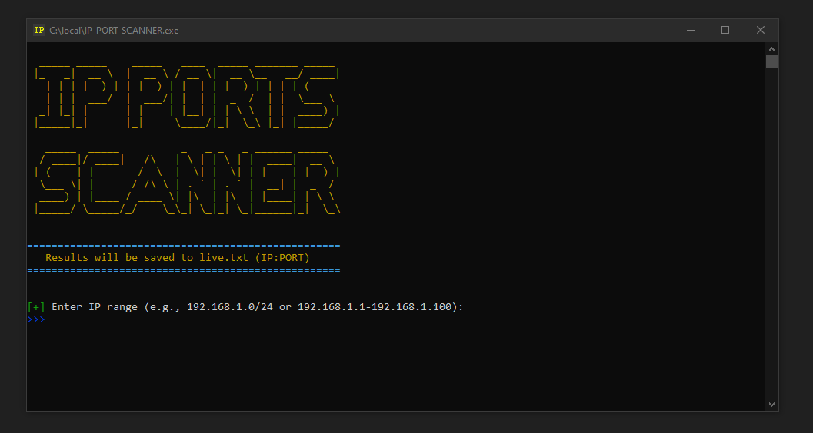

IP PORT SCANNER
==============================

A lightweight tool to scan IP ranges for open ports quickly.

✨ Screenshot
--------------

📦 Installation
--------------
1. Download `IP-PORT-SCANNER.exe` from Releases
2. Double-click to run (no installation needed)

🛠 Basic Usage
-------------
1. Run the program
2. Enter IP range (e.g., 192.168.1.1-192.168.1.100)
3. Enter ports (e.g., 80,443 or 20-25)
4. Set thread count (50-200 recommended)
5. View results in console and `live.txt`

⚡ Features
----------
- Fast multi-threaded scanning
- Color-coded results (GREEN=OPEN, RED=CLOSED)
- Supports IP ranges and port lists
- Saves results to `live.txt`

📝 Sample Output
---------------
`192.168.1.5:80`

`192.168.1.10:22`

`192.168.1.15:443`

⚠ Legal Note
-----------
Only scan networks you have permission to test.
